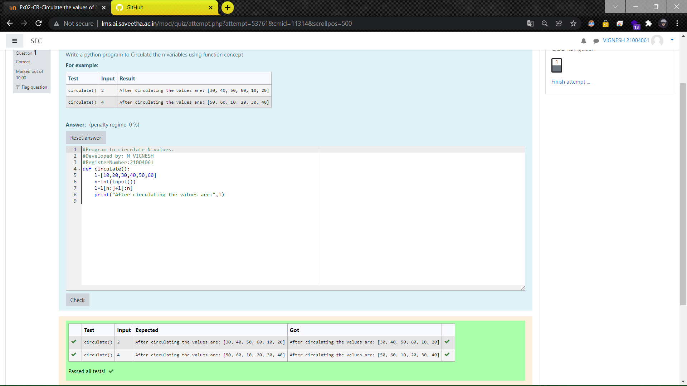

# Circulate-the-values-of-N-variables
## Aim:
To write a python program to circulate the n variables using function concept
## Equipment’s required:
PC
Anaconda - Python 3.7
## Algorithm: 
### Step 1: 
Define a function with the function name as circulate
### Step 2: 
the vaInitialize lues in a list
### Step 3: 
Get the value from the user for the number of rotation
### Step 4: 
Using the slicing concept rotate the list
### Step 5: 
Print the list
### Step 6: 
End the program
## Program:
~~~
#Program to circulate N values.
#Developed by: M VIGNESH
#RegisterNumber:21004061
def circulate():
    l=[10,20,30,40,50,60]
    n=int(input())
    l=l[n:]+l[:n]
    print("After circulating the values are:"
    l)
~~~

## Output:

## Result:
Thus the circulating the n variables is successfully executed
